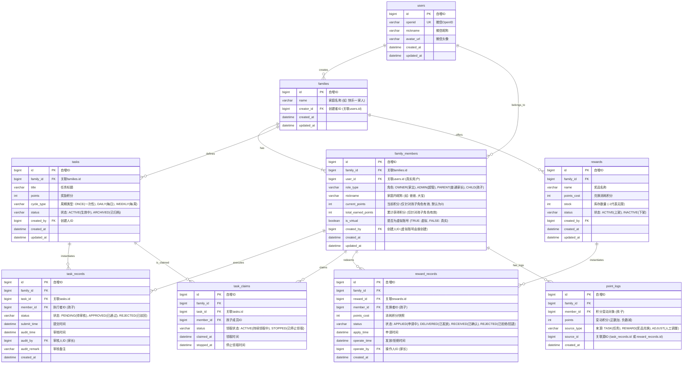

```mermaid
erDiagram
    %% 用户表：存储微信授权后的基础信息
    users {
        bigint id PK "自增ID"
        varchar openid UK "微信OpenID"
        varchar nickname "微信昵称"
        varchar avatar_url "微信头像"
        datetime created_at
        datetime updated_at
    }

    %% 家庭表
    families {
        bigint id PK "自增ID"
        varchar name "家庭名称 (如: 快乐一家人)"
        bigint creator_id FK "创建者ID (关联users.id)"
        datetime created_at
        datetime updated_at
    }

    %% 家庭成员表：连接用户与家庭，定义角色与权限
    family_members {
        bigint id PK "自增ID"
        bigint family_id FK "关联families.id"
        bigint user_id FK "关联users.id (真实用户)"
        varchar role_type "角色: OWNER(家主), ADMIN(超管), PARENT(普通家长), CHILD(孩子)"
        varchar nickname "家庭内昵称 (如: 爸爸, 大宝)"
        int current_points "当前积分 (仅针对孩子角色有效, 默认为0)"
        int total_earned_points "累计获得积分 (仅针对孩子角色有效)"
        boolean is_virtual "是否为虚拟账号 (TRUE: 虚拟, FALSE: 真实)"
        bigint created_by FK "创建人ID (虚拟账号由谁创建)"
        datetime created_at
        datetime updated_at
    }

    %% 任务库表
    tasks {
        bigint id PK "自增ID"
        bigint family_id FK "关联families.id"
        varchar title "任务标题"
        int points "奖励积分"
        varchar cycle_type "周期类型: ONCE(一次性), DAILY(每日), WEEKLY(每周)"
        varchar status "状态: ACTIVE(生效中), ARCHIVED(已归档)"
        bigint created_by FK "创建人ID"
        datetime created_at
        datetime updated_at
    }

    %% 任务记录表 (核心流水)
    task_records {
        bigint id PK "自增ID"
        bigint family_id FK
        bigint task_id FK "关联tasks.id"
        bigint member_id FK "执行者ID (孩子)"
        varchar status "状态: PENDING(待审核), APPROVED(已通过), REJECTED(已驳回)"
        datetime submit_time "提交时间"
        datetime audit_time "审核时间"
        bigint audit_by FK "审核人ID (家长)"
        varchar audit_remark "审核备注"
        datetime created_at
    }

    %% 循环任务领取关系表：记录孩子对循环任务的持续领取状态
    task_claims {
        bigint id PK "自增ID"
        bigint family_id FK
        bigint task_id FK "关联tasks.id"
        bigint member_id FK "孩子成员ID"
        varchar status "领取状态: ACTIVE(持续领取中), STOPPED(已停止领取)"
        datetime claimed_at "领取时间"
        datetime stopped_at "停止领取时间"
    }

    %% 奖品库表
    rewards {
        bigint id PK "自增ID"
        bigint family_id FK
        varchar name "奖品名称"
        int points_cost "兑换消耗积分"
        int stock "库存数量 (-1代表无限)"
        varchar status "状态: ACTIVE(上架), INACTIVE(下架)"
        bigint created_by FK
        datetime created_at
        datetime updated_at
    }

    %% 奖品兑换记录表 (核心流水)
    reward_records {
        bigint id PK "自增ID"
        bigint family_id FK
        bigint reward_id FK "关联rewards.id"
        bigint member_id FK "兑换者ID (孩子)"
        int points_cost "消耗积分快照"
        varchar status "状态: APPLIED(申请中), DELIVERED(已发放), RECEIVED(已确认), REJECTED(已拒绝/回退)"
        datetime apply_time "申请时间"
        datetime operate_time "发放/拒绝时间"
        bigint operate_by FK "操作人ID (家长)"
        datetime created_at
    }

    %% 积分流水表 (账单)
    point_logs {
        bigint id PK "自增ID"
        bigint family_id FK
        bigint member_id FK "积分变动对象 (孩子)"
        int points "变动积分 (正数加, 负数减)"
        varchar source_type "来源: TASK(任务), REWARD(奖品兑换), ADJUST(人工调整)"
        bigint source_id "关联源ID (task_records.id 或 reward_records.id)"
        datetime created_at
    }

    %% 关系定义
    users ||--o{ families : "creates"
    users ||--o{ family_members : "belongs_to"
    families ||--|{ family_members : "has"
    families ||--o{ tasks : "defines"
    families ||--o{ rewards : "offers"
    family_members ||--o{ task_records : "executes"
    tasks ||--o{ task_records : "instantiates"
    family_members ||--o{ task_claims : "claims"
    tasks ||--o{ task_claims : "is_claimed"
    family_members ||--o{ reward_records : "redeems"
    rewards ||--o{ reward_records : "instantiates"
    family_members ||--o{ point_logs : "has_logs"
```
